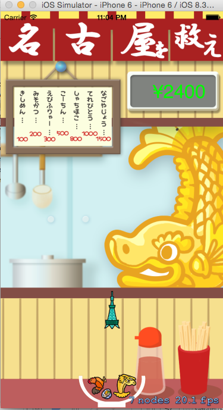

#SpriteKit の利用

書籍： Sprite Kit iPhone 2Dゲームプログラミング 3 章 のゲームを改良した。
See  http://www.shuwasystem.co.jp/support/7980html/4055.html

## 操作：
クリック、スライドで画面下部にあるどんぶりが移動します。  
ゲームオーバーになったら、画面をクリックすると またゲーウが始まります。  

## 改良点
- BGM を流すようにした。
- Sprite の大きさを小さくした。
- ゲームオーバーした時に、画面クリックで、ゲーム再開できるようにした。

